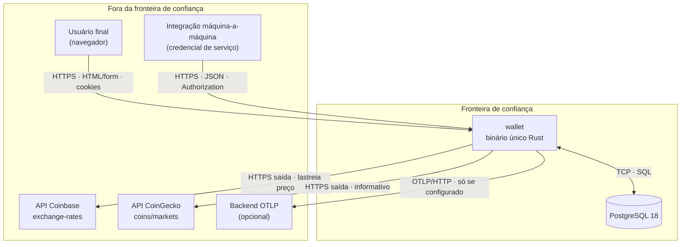
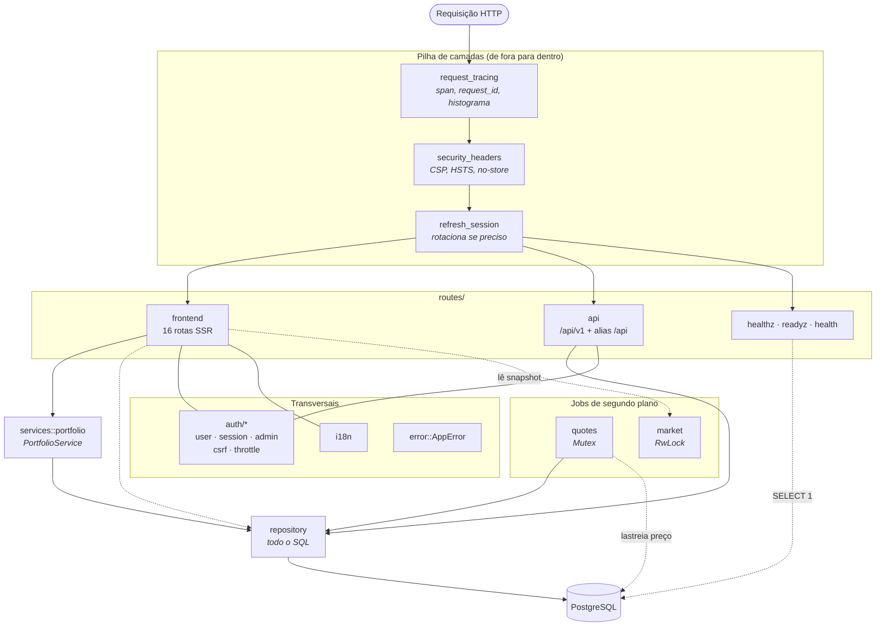
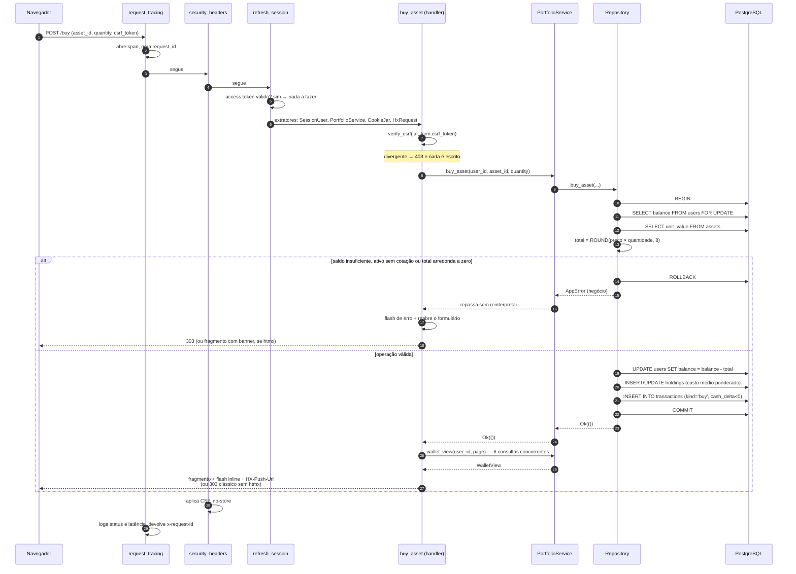
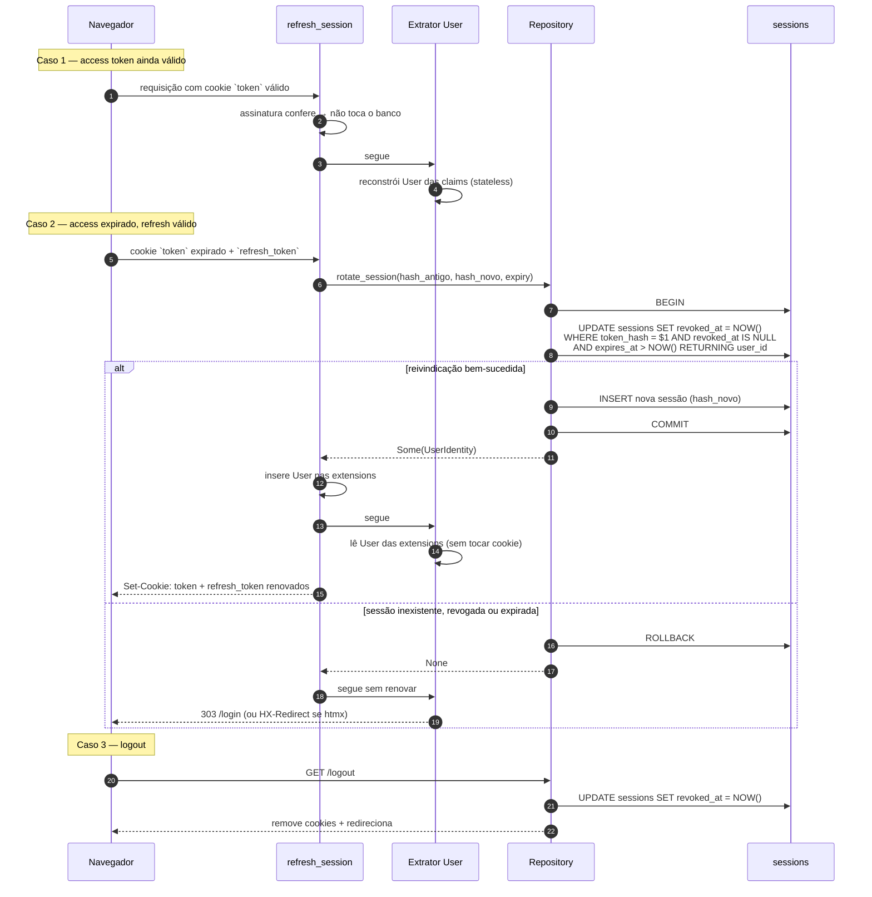
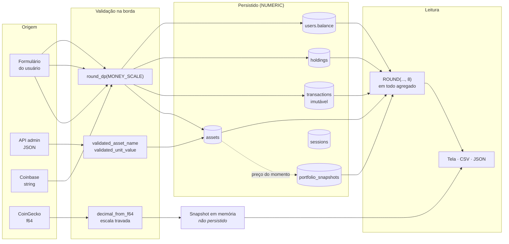
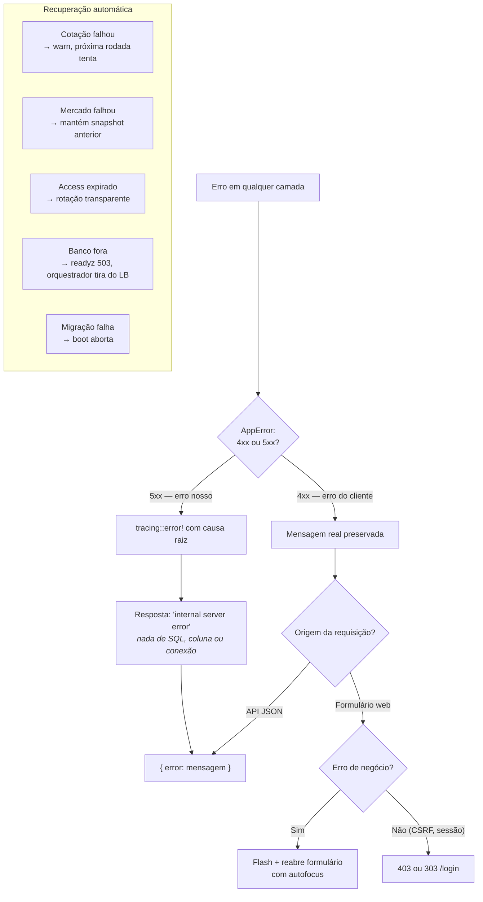
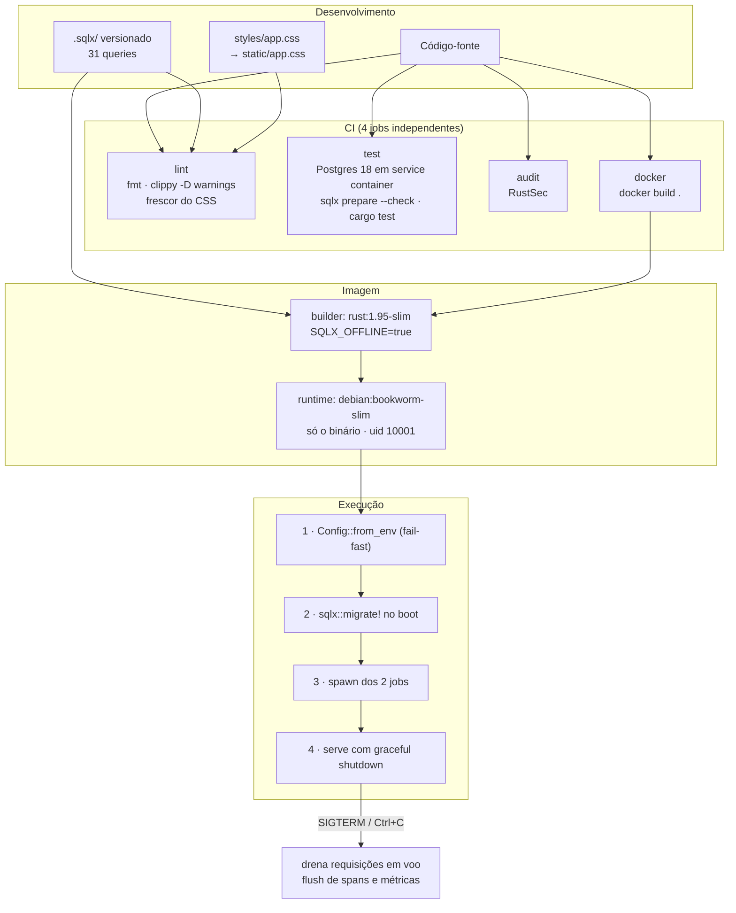

# Fluxos e diagramas

## Objetivo

Representar graficamente os fluxos que atravessam mais de um componente, cada um
acompanhado da explicação textual correspondente. Nenhum diagrama aqui é a única
fonte da informação: o texto ao lado sustenta o que o desenho resume.

## Escopo

Coberto: contexto, componentes, sequência de uma operação financeira,
autenticação e renovação de sessão, ciclo de vida dos dados, tratamento de erro e
implantação. Não coberto: contratos de campo (ver [../api/](../api/)) e a ficha
individual de cada componente (ver
[component-architecture.md](component-architecture.md)).

---


**Leitura.** O laço percorre em 7,7 s o que as seções seguintes detalham paradas: as
três camadas na ordem em que são aplicadas e os caminhos que contornam a camada de
serviço (§2), a compra até o `COMMIT` e as seis consultas concorrentes que montam a
`WalletView` (§3), e as duas integrações externas com destinos diferentes (§1) — âmbar
chega ao banco, violeta termina em memória. Como todo desenho deste documento, ele
**resume**: o texto de cada seção é o que sustenta a afirmação.

---

## 1. Diagrama de contexto

Quem interage com o sistema e por qual fronteira.



**Leitura.** O sistema tem **dois** consumidores de entrada e **três**
dependências de saída. A assimetria importa para segurança: as entradas são
superfícies de ataque (validação, autenticação, CSRF, lockout); as saídas são
riscos de disponibilidade e de integridade de dado de terceiro.

As duas integrações externas têm **naturezas diferentes**, e confundi-las seria o
erro mais custoso do sistema:

| | Coinbase | CoinGecko |
| --- | --- | --- |
| Papel | **Lastreia dinheiro**: define `assets.unit_value`, que é o preço de compra e venda | **Informativo**: alimenta só a tela de mercado |
| Formato do número | String com precisão arbitrária → `Decimal` sem passar por float | Número JSON → `f64` → `Decimal` com escala travada |
| Persistido? | Sim, em `assets` | Não, só em memória |
| Se ficar indisponível | Preços congelam no último valor válido; operações continuam funcionando | Tela de mercado mostra estado de carregamento; nada mais é afetado |

O backend OTLP é a única dependência **verdadeiramente opcional**: sem
`OTEL_EXPORTER_OTLP_ENDPOINT`, não há tentativa de conexão.

## 2. Diagrama de componentes



**Leitura.** As três camadas são aplicadas de fora para dentro, e a ordem é
funcional, não estética:

- `request_tracing` é a **mais externa** de propósito: assim até os logs dos
  middlewares internos saem correlacionados ao mesmo `request_id`, e a métrica de
  duração cobre a requisição inteira, cabeçalhos de segurança inclusos.
- `security_headers` vem antes do roteamento porque se aplica a **toda** resposta,
  inclusive erros e 404 — não é algo que cada handler precise lembrar de fazer.
- `refresh_session` roda antes de qualquer handler para que a sessão já esteja
  renovada **antes** do extrator `User` tentar ler o cookie.

As setas tracejadas marcam acessos que **contornam** a camada de serviço: o
`frontend` fala direto com o `Repository` nos casos que não envolvem a carteira
(login, logout, CSV, sincronização manual), e a sonda de readiness executa
`SELECT 1` sem passar por nada. Ambos são deliberados — não há visão de portfólio
a montar nesses caminhos.

Evidência: `src/app.rs` · `App::router`.

## 3. Sequência: compra de um ativo

O caminho mais completo do sistema — passa por CSRF, sessão, serviço, transação de
banco e resposta condicional a htmx.



**Leitura.** Três propriedades que o diagrama torna visíveis:

1. **A verificação de CSRF acontece antes de qualquer escrita.** Um token
   divergente resulta em 403 com o saldo intacto — e o teste
   `forms_without_a_matching_csrf_token_are_refused` confere justamente que o
   saldo continua zerado, não apenas que o status é 403. Conferir só o status
   deixaria passar um refactor que redireciona bonito e credita de qualquer forma.

2. **A recusa é atômica.** Saldo insuficiente causa `ROLLBACK`, não uma escrita
   parcial. O `FOR UPDATE` no `SELECT` do saldo serializa compras concorrentes do
   mesmo usuário: sem ele, duas compras simultâneas poderiam ambas ler o saldo
   antigo e ambas passar a validação.

3. **A resposta é única, não um redirect seguido de GET.** Em requisição htmx, a
   mesma resposta traz o fragmento atualizado, o banner inline e o `HX-Push-Url` —
   uma requisição em vez de duas. Sem htmx (sem JavaScript, ou restauração de
   histórico), vale o PRG clássico.

Evidência: `src/routes/frontend.rs` · `buy_asset`, `render_wallet`;
`src/repository.rs` · `buy_asset`; `src/services/portfolio.rs` · `wallet_view`.

## 4. Fluxo de autenticação e renovação de sessão



**Leitura.** O `UPDATE ... RETURNING` é a peça central e merece ser lido com
atenção: ele **reivindica** a sessão numa operação atômica. Se um token roubado e
o legítimo tentarem rotacionar ao mesmo tempo, o segundo a chegar encontra a
sessão já revogada (`revoked_at IS NULL` não bate mais) e recebe `None`. **Não há
janela de corrida em que os dois consigam rotacionar.**

Divisão de responsabilidade entre os dois tokens:

| | Access token | Refresh token |
| --- | --- | --- |
| Formato | JWT HS256 com claims (`id`, `username`, `role`) | 32 bytes aleatórios, **opaco** |
| Validade | `SESSION_TTL_MINUTES` (10 min) | `REFRESH_TTL_DAYS` (14 dias) |
| Validação | Só assinatura — **não toca o banco** | Consulta `sessions` por hash |
| No banco | Nada | Só a **hash SHA-256** |
| Revogável | Não, até expirar | **Sim**, de verdade |

O valor em claro do refresh token nunca toca o banco: um vazamento do banco não
vaza token utilizável.

Evidência: `src/auth/session.rs` · `refresh_session`, `RefreshToken`;
`src/repository.rs` · `rotate_session`, `revoke_session`;
`migrations/20260716000001_create_sessions.up.sql`.

## 5. Ciclo de vida dos dados



**Leitura.** Há **duas** barreiras de escala, e ambas são necessárias:

- **Na escrita**, todo valor monetário é arredondado para `MONEY_SCALE = 8` antes
  de chegar ao banco.
- **Na leitura**, todo agregado SQL que soma ou multiplica `NUMERIC` é envolvido
  em `ROUND(..., 8)`.

A segunda barreira parece redundante e não é: produtos e somas de `NUMERIC`
acumulam escala **sem limite**, então a leitura falharia com `value not
representable` mesmo com cada coluna individual dentro do invariante. Foi
exatamente esse o incidente de 2026-07-22 — `/assets` respondendo 500 para
qualquer conta com posições.

Repare no caminho da CoinGecko: ele termina em memória e **nunca** cruza para as
tabelas. É a separação que garante que cotação informativa não contamine o
catálogo que lastreia operações.

`transactions` é o único destino **imutável** — só recebe `INSERT`. A migração de
saneamento `normalize_money_scales` deliberadamente **não** tocou nessa tabela:
é histórico, e todos os seus valores foram gravados via `Decimal`, logo já são
representáveis na volta.

Detalhamento por campo em [../data/data-dictionary.md](../data/data-dictionary.md).

## 6. Fluxo de erro e recuperação



**Leitura.** A distinção 4xx/5xx é a decisão mais importante do tratamento de
erro, e ela é tomada num só lugar:

```rust
let error = if status.is_server_error() {
    tracing::error!(error = ?self, "internal error serving request");
    "internal server error".to_string()
} else {
    self.to_string()
};
```

Erros 4xx (senha errada, saldo insuficiente, CSRF divergente) devolvem a mensagem
real — não revelam nada sobre como o sistema funciona por dentro. Erros 5xx são
logados **inteiros**, com a causa raiz encadeada pelo `thiserror`, e o cliente
recebe só a mensagem genérica: nunca o texto de erro do SQL, nome de coluna ou
string de conexão.

As cinco recuperações automáticas têm graus deliberadamente diferentes de
severidade:

| Falha | Comportamento | Por que este e não outro |
| --- | --- | --- |
| Rodada de cotação | `warn` e segue; próxima tenta | Cotação atrasada não justifica recusar operações — os preços anteriores continuam válidos |
| Rodada de mercado | Mantém o snapshot anterior | Dado informativo defasado é melhor que tela quebrada |
| Access token expirado | Rotação transparente | O usuário não deveria perceber |
| Banco indisponível | `/readyz` → 503 | O orquestrador tira do balanceador **sem reiniciar** — reiniciar o app não conserta um Postgres fora do ar |
| Migração falha no boot | Processo aborta | "Melhor não subir do que subir contra um schema pela metade" |
| Exportador OTLP malformado | `eprintln!` e segue sem exportar | Observabilidade é infraestrutura auxiliar; não vale recusar servir requisições financeiras por causa dela |

Procedimentos operacionais correspondentes em
[../operations/runbooks.md](../operations/runbooks.md).

## 7. Fluxo de build e implantação



**Leitura.** Duas propriedades do build merecem destaque:

**O binário nasce sem nunca ter falado com um banco.** O cache `.sqlx/` versionado
(31 arquivos de query) permite que `SQLX_OFFLINE=true` valide as queries em tempo
de compilação sem conexão. O preço é que o cache pode descolar do schema — por
isso o CI roda `cargo sqlx prepare --check`.

**O CSS compilado é versionado pelo mesmo motivo, e sofre do mesmo risco.** O
binário embute `static/app.css` via `include_str!`; se alguém usar uma classe nova
sem recompilar, nada no build de Rust perceberia e o estilo simplesmente faltaria
em produção. O job `lint` recompila e faz `diff` para provar o frescor.

A imagem final leva **só o binário** — nenhuma toolchain, nenhum código-fonte,
nenhuma dependência de build — e roda como usuário sem privilégio (`uid 10001`).
Templates e migrações já vão embutidos no executável (`#[derive(Template)]` do
Askama, `sqlx::migrate!()`).

A ordem do boot é fail-fast em cada etapa: configuração inválida, banco
inacessível ou migração falha abortam **antes** de a porta abrir. O desligamento é
gracioso em SIGTERM (Docker/Kubernetes) e Ctrl+C, e o `Drop` do `OtelGuard` escoa
os spans e métricas ainda em buffer.

Procedimento completo em [../operations/deployment.md](../operations/deployment.md).

## 8. Evidências

```text
- src/app.rs             · App::router, App::start, security_headers, request_tracing
- src/auth/session.rs    · refresh_session
- src/repository.rs      · buy_asset, rotate_session, wallet_summary
- src/services/portfolio.rs · wallet_view (tokio::try_join!)
- src/error.rs           · IntoResponse for AppError
- Dockerfile             · estágios builder e runtime
- .github/workflows/ci.yml · jobs lint, test, audit, docker
- migrations/            · 11 pares up/down
```
