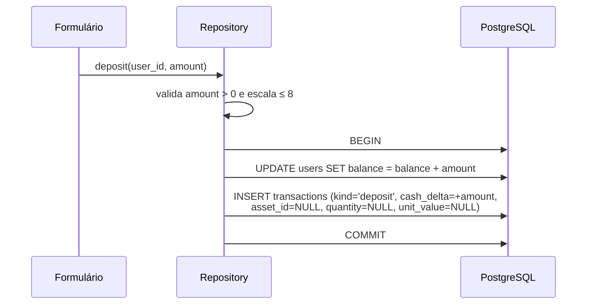
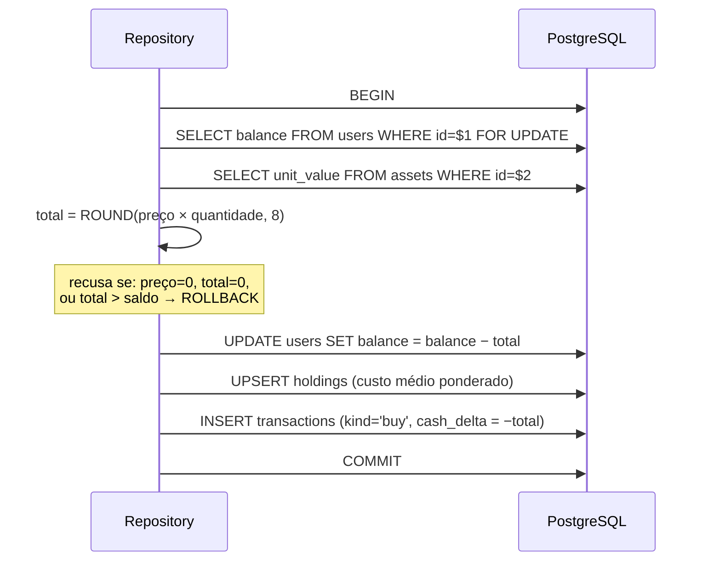
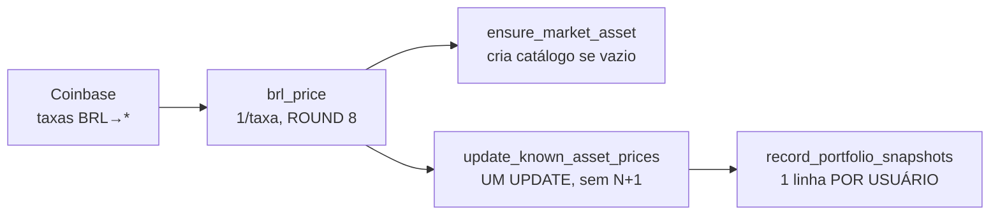

# Modelo e ciclo de vida dos dados

## Objetivo

Explicar o modelo de domínio — que entidades existem, como se relacionam e por que
foram modeladas assim — e o ciclo de vida de cada dado, da origem ao destino.

## Escopo

Coberto: entidades, invariantes de negócio, fluxo de escrita e leitura, crescimento e
retenção. Não coberto: DDL e restrições (ver
[database-schema.md](database-schema.md)), campo a campo (ver
[data-dictionary.md](data-dictionary.md)) e histórico das migrações (ver
[migrations.md](migrations.md)).

---

## 1. O modelo de domínio em uma frase

Um **usuário** tem caixa (`balance`) e **posições** (`holdings`) em **ativos**
(`assets`) de um catálogo compartilhado; todo movimento é registrado num
**livro-razão imutável** (`transactions`), e o patrimônio total é fotografado
periodicamente (`portfolio_snapshots`).

A decisão estrutural que sustenta isso é a separação entre **posição atual** e
**histórico** — ver [ADR-0005](../adr/0005-holdings-materializados-e-livro-razao.md).

## 2. As duas naturezas de dado

Toda tabela do sistema cai em uma de duas categorias, e a distinção governa como
cada uma é tratada:

| | **Estado mutável** | **Registro imutável** |
| --- | --- | --- |
| Tabelas | `users`, `assets`, `holdings`, `sessions` | `transactions`, `portfolio_snapshots` |
| Operações | `INSERT`, `UPDATE`, `DELETE` | Só `INSERT` |
| Responde a | "Como está agora?" | "O que aconteceu?" |
| Reconstruível? | `holdings` é reconstruível de `transactions` | Não — é a fonte |
| Saneável por migração | Sim (e foi, em `normalize_money_scales`) | **Não** — reescrever histórico contradiz a natureza |

Essa distinção não é acadêmica: a migração de saneamento de escala **deliberadamente
não tocou** em `transactions`, e a justificativa está escrita nela — "o livro-razão
fica INTACTO: é histórico imutável e todos os seus valores foram gravados via
`Decimal` (logo, são representáveis na volta)."

## 3. Invariantes de negócio

Regras que o sistema mantém verdadeiras em qualquer estado observável:

| # | Invariante | Sustentado por |
| --- | --- | --- |
| I1 | Saldo nunca é negativo | Verificação em transação + `CHECK` |
| I2 | Posição nunca é negativa (sem venda a descoberto) | Verificação em transação + `CHECK` |
| I3 | Preço de ativo nunca é negativo | `validated_unit_value` + `CHECK` |
| I4 | Toda operação de dinheiro gera **exatamente uma** linha em `transactions` | Transação atômica |
| I5 | Posição com quantidade zero **não existe** como linha | `sell_asset` apaga a linha |
| I6 | Todo valor monetário persistido tem escala ≤ 8 casas | `round_dp` na escrita — **só em Rust** |
| I7 | Custo médio reflete apenas as unidades ainda possuídas | Venda parcial não recalcula |
| I8 | `cash_delta` tem o sinal do movimento | Cálculo em `deposit`/`buy`/`sell` |
| I9 | Um refresh token vale **uma** rotação | `UPDATE ... RETURNING` atômico |
| I10 | Papel padrão é `user` | `DEFAULT` + `CHECK` |

**I6 é o invariante mais frágil**: é o único sem garantia no schema. `NUMERIC` sem
precisão declarada aceita qualquer escala, então um `INSERT` manual ainda pode gravar
28 casas. A mitigação é dupla — arredondar na escrita e `ROUND` na leitura — mas foi
por essa fresta que passou o incidente de 2026-07-22.

## 4. Ciclo de vida por operação

### 4.1 Depósito



As duas escritas são **uma** transação: uma sem a outra é livro-razão furado —
travado por `deposit_credits_balance_and_logs_transaction`.

### 4.2 Compra



O `FOR UPDATE` é essencial: sem ele, duas compras simultâneas do mesmo usuário
poderiam ambas ler o saldo antigo e ambas passar a validação.

Cálculo do custo médio na compra:

```text
avg_cost_novo = (qtd_antiga × avg_cost_antigo + qtd_nova × preço_atual)
                / (qtd_antiga + qtd_nova)
```

Exemplo travado por teste: comprar 2 a 10 e depois 2 a 20 resulta em custo médio
`(2×10 + 2×20) / 4 = 15`.

### 4.3 Venda

Simétrica à compra, com duas diferenças que importam:

1. **O custo médio não é recalculado.** Ele se refere ao que foi pago pelas unidades
   que **permanecem**; recalcular na venda inventaria lucro.
2. **A linha é apagada** se a posição zerar, em vez de ficar com quantidade 0.

### 4.4 Rodada de cotações



Uma rodada faz **duas** coisas: atualiza preços **e** fotografa o patrimônio de
todos os usuários. As duas andam juntas porque é exatamente quando os preços mudam
que o patrimônio muda.

`update_known_asset_prices` usa `UNNEST` para transformar dois arrays numa tabela
virtual e fazer `UPDATE ... FROM` — **um statement só**, não um `UPDATE` por ativo.

## 5. Origem e destino de cada dado

| Dado | Origem | Transformação | Destino | Consumidor final |
| --- | --- | --- | --- | --- |
| Senha | Formulário | argon2 | `users.password_hash` | Verificação de login |
| Saldo | Depósito/operações | Aritmética `Decimal` | `users.balance` | Tela, resumo |
| Preço de ativo | Coinbase (string) ou admin | `1/taxa`, `ROUND(8)` | `assets.unit_value` | **Operações financeiras** |
| Posição | Compra/venda | Custo médio ponderado | `holdings` | Tela, resumo |
| Movimento | Operação | `cash_delta` assinado | `transactions` | Extrato, CSV, auditoria |
| Patrimônio | Rodada de cotações | Caixa + posições | `portfolio_snapshots` | Gráfico de evolução |
| Refresh token | `OsRng` | SHA-256 | `sessions.token_hash` | Rotação, revogação |
| Cotação informativa | CoinGecko (`f64`) | Escala travada | **Memória** | Tela de mercado |

A última linha é a exceção importante: **o feed da CoinGecko nunca chega ao banco**.
É a separação que impede cotação informativa de contaminar o catálogo que lastreia
operações ([ADR-0009](../adr/0009-snapshot-de-mercado-em-memoria.md)).

## 6. Leitura: por que os agregados precisam de `ROUND`

Seis consultas independentes montam a tela da carteira, executadas **concorrentemente**
com `tokio::try_join!`:

| Consulta | O que traz |
| --- | --- |
| `wallet_summary` | Saldo, valor das posições, total, investido, resultado |
| `list_holdings` | Posições com valor atual e resultado por ativo |
| `list_assets` | Catálogo, para o formulário de compra |
| `list_transactions` | Página do extrato (25 por página) |
| `count_transactions` | Total, para a paginação |
| `list_portfolio_snapshots` | Últimos 60 pontos do gráfico |

**Todo agregado que soma ou multiplica `NUMERIC` é envolvido em `ROUND(..., 8)`.**
Isso parece redundante — cada coluna já está dentro do invariante — e não é: produtos
e somas de `NUMERIC` acumulam escala **sem limite**, então a leitura falharia com
`value not representable` mesmo com dados corretos.

Foi exatamente esse o incidente de 2026-07-22, e o teste
`legacy_high_scale_money_still_renders_the_wallet` existe para que a classe de bug
não volte: ele planta valores de 28 casas no banco e confirma que toda leitura ainda
decodifica.

## 7. Crescimento e retenção

| Tabela | Cresce com | Volume estimado | Expurgo |
| --- | --- | --- | :---: |
| `users` | Cadastros | Baixo | **Não** |
| `assets` | Catálogo | ~7 linhas | **Não** |
| `holdings` | Posições abertas | ≤ ativos × usuários | **Sim** (ao zerar) |
| `transactions` | **Atividade** | Proporcional ao uso | **Não** (por decisão) |
| `sessions` | **Renovações** | ~6 linhas/hora por sessão ativa | **Não** ← problema |
| `portfolio_snapshots` | **Tempo × usuários** | **144 linhas/usuário/dia** | **Não** ← problema |

As duas últimas crescem **independentemente da atividade do usuário** e não têm
limpeza. `portfolio_snapshots` é a mais preocupante: cresce com o relógio, e o
gráfico lê apenas os últimos 60 pontos — o resto nunca é consultado.

Registrados como **DT-02** e **DT-03** em
[../decisions/technical-debt.md](../decisions/technical-debt.md).

## 8. O que o modelo não suporta

Limitações estruturais, não defeitos pontuais:

| Não suportado | Por quê |
| --- | --- |
| **Saque** | Não há `kind = 'withdraw'`; o `CHECK` recusaria |
| **Transferência entre usuários** | Nenhuma operação move dinheiro entre contas |
| **Múltiplas moedas de denominação** | Tudo é BRL; não há coluna de moeda |
| **Venda a descoberto** | `CHECK (quantity >= 0)` impede |
| **Ordem limitada / agendada** | Operações são a mercado, imediatas |
| **Reversão de operação** | `transactions` é imutável; não há estorno |
| **Preço histórico do catálogo** | `assets.unit_value` guarda só o valor atual |
| **Exclusão de conta** | Não implementada; chaves estrangeiras impediriam sem cascata |
| **Reconciliação `holdings` × `transactions`** | Nenhuma consulta confere a correspondência |

O último item é o mais relevante: as duas tabelas **podem divergir** se um caminho de
escrita futuro atualizar uma sem a outra. A garantia atual é a transação, que é forte
— mas depende de disciplina no código, não de constraint.

## 9. Pontos de evolução

Não implementados; listados para não serem lidos como capacidade atual:

1. **Expurgo de `sessions`** revogadas/expiradas (job ou `DELETE` periódico).
2. **Agregação de `portfolio_snapshots`** antigos (manter granularidade fina só nos
   últimos dias).
3. **Consulta de reconciliação** entre `holdings` e `transactions`.
4. **Restrição de escala no schema** (`NUMERIC(38, 8)`), fechando I6 na camada que
   nenhum caminho de escrita contorna.
5. Índice em `holdings.asset_id`, se surgir consulta por ativo.

## 10. Evidências

```text
- migrations/20260613000002_holdings_and_transactions.up.sql  (a decisão de modelo)
- migrations/20260722000000_normalize_money_scales.up.sql      (saneamento; poupa transactions)
- src/repository.rs · deposit, buy_asset, sell_asset,
                      wallet_summary, list_holdings, list_transactions,
                      record_portfolio_snapshots, update_known_asset_prices,
                      ensure_market_asset
- src/services/portfolio.rs · wallet_view (try_join! das 6 consultas)
- src/models.rs             · MONEY_SCALE, WalletSummary, Holding, Transaction
- testes: deposit_credits_balance_and_logs_transaction,
          buying_more_averages_the_cost_basis,
          partial_sell_keeps_remaining_units,
          selling_everything_closes_the_position,
          legacy_high_scale_money_still_renders_the_wallet,
          portfolio_snapshots_capture_cash_plus_holdings
```
