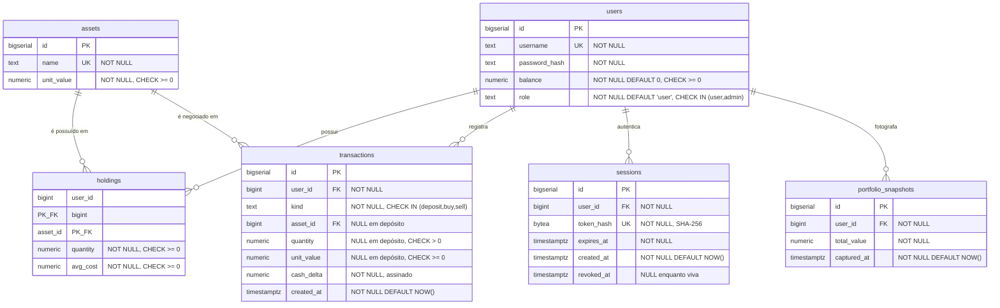

# Schema do banco de dados

## Objetivo

Descrever o estado atual do schema PostgreSQL: tabelas, colunas, tipos, restrições,
índices e relacionamentos, com o motivo de cada decisão estrutural.

## Escopo

Coberto: as 6 tabelas em uso, suas restrições e índices. Não coberto: a semântica de
negócio de cada campo (ver [data-dictionary.md](data-dictionary.md)), o ciclo de vida
dos dados (ver [data-model.md](data-model.md)) e a história das migrações (ver
[migrations.md](migrations.md)).

---

## 1. Diagrama de entidades



**`users` é o centro de tudo.** As quatro tabelas que dependem dela cobrem
propósitos distintos: posição atual (`holdings`), histórico imutável
(`transactions`), autenticação (`sessions`) e série temporal (`portfolio_snapshots`).

`assets` é o **catálogo compartilhado**: não pertence a nenhum usuário, e é a única
tabela escrita por caminho administrativo e pelo job de cotações.

## 2. Definição das tabelas

### 2.1 `users`

```sql
id            BIGSERIAL  PRIMARY KEY NOT NULL
username      TEXT       NOT NULL UNIQUE
password_hash TEXT       NOT NULL
balance       NUMERIC    NOT NULL DEFAULT 0
role          TEXT       NOT NULL DEFAULT 'user'

CONSTRAINT users_balance_non_negative CHECK (balance >= 0)
CHECK (role IN ('user', 'admin'))
```

| Decisão | Motivo |
| --- | --- |
| `username UNIQUE` | É a chave de login, como um e-mail seria |
| `password_hash TEXT` | A hash argon2 inclui algoritmo e parâmetros — permite migrar de algoritmo sem migração de dados |
| `balance NUMERIC` | Dinheiro exato ([ADR-0004](../adr/0004-decimal-e-numeric-para-dinheiro.md)) |
| `CHECK (balance >= 0)` | Última linha de defesa: nenhum caminho de escrita cria saldo negativo |
| `role DEFAULT 'user'` | **Privilégio não pode ser o default** |
| `CHECK (role IN (...))` | O banco recusa qualquer papel fora dos dois — travado por teste |

**Não há** coluna de e-mail, telefone, nome completo, data de criação ou último
acesso. O sistema coleta o mínimo: username e hash de senha.

### 2.2 `assets`

```sql
id         BIGSERIAL PRIMARY KEY NOT NULL
name       TEXT      NOT NULL UNIQUE
unit_value NUMERIC   NOT NULL

CONSTRAINT assets_unit_value_non_negative CHECK (unit_value >= 0)
```

| Decisão | Motivo |
| --- | --- |
| `name UNIQUE` | A sincronização de cotações casa por nome normalizado; duplicata quebraria o casamento |
| `unit_value NUMERIC` | Era `DOUBLE PRECISION`; migrado por ruído de arredondamento |
| `CHECK (unit_value >= 0)` | Preço negativo **inverteria a matemática**: uma compra creditaria o saldo em vez de debitar |

> Não há coluna de "ativo negociável". Um ativo com `unit_value = 0` é tratado como
> **sem cotação** e recusado na negociação em código (`QuoteUnavailable`), não no
> schema.

### 2.3 `holdings` — posição materializada

```sql
user_id  BIGINT  NOT NULL REFERENCES users (id)
asset_id BIGINT  NOT NULL REFERENCES assets (id)
quantity NUMERIC NOT NULL
avg_cost NUMERIC NOT NULL

PRIMARY KEY (user_id, asset_id)
CHECK (quantity >= 0)
CHECK (avg_cost >= 0)
```

| Decisão | Motivo |
| --- | --- |
| **Chave primária composta** | Uma linha por posição; duas linhas para o mesmo par são estruturalmente impossíveis |
| **Sem coluna `id`** | Não há necessidade de identificador próprio — a posição é identificada pelo par |
| `avg_cost` | Custo médio **ponderado** das unidades atualmente possuídas; base do lucro/prejuízo |
| Linha **apagada** ao zerar | Posição fechada sai da carteira em vez de ficar com quantidade 0 |

Na prática `quantity` é sempre estritamente positiva: o `CHECK` permite zero, mas o
código apaga a linha nesse caso.

### 2.4 `transactions` — livro-razão imutável

```sql
id         BIGSERIAL   PRIMARY KEY NOT NULL
user_id    BIGINT      NOT NULL REFERENCES users (id)
kind       TEXT        NOT NULL CHECK (kind IN ('deposit', 'buy', 'sell'))
asset_id   BIGINT      REFERENCES assets (id)
quantity   NUMERIC
unit_value NUMERIC
cash_delta NUMERIC     NOT NULL
created_at TIMESTAMPTZ NOT NULL DEFAULT NOW()

CONSTRAINT transactions_quantity_positive
    CHECK (quantity IS NULL OR quantity > 0)
CONSTRAINT transactions_unit_value_non_negative
    CHECK (unit_value IS NULL OR unit_value >= 0)

INDEX idx_transactions_user_created ON (user_id, created_at DESC)
```

| Decisão | Motivo |
| --- | --- |
| **Só recebe `INSERT`** | É histórico e auditoria; nenhum caminho de código faz `UPDATE` ou `DELETE` aqui |
| `kind` com `CHECK` | Restrito aos três movimentos suportados. Um tipo novo exige migração — deliberadamente restritivo |
| `asset_id`, `quantity`, `unit_value` **nulos** | Depósito não envolve ativo. Usar zero seria um valor falso |
| `CHECK` tolerando `NULL` | Os `CHECK` só "mordem" em linhas de compra/venda |
| `cash_delta` **assinado** | Depósito `> 0`, compra `< 0`, venda `> 0`. Permite conferir a soma do extrato contra o saldo |
| `unit_value` gravado | É o preço **no momento da operação**, não o atual — sem ele o histórico perderia sentido |
| Índice `(user_id, created_at DESC)` | Espelha exatamente o padrão de acesso: filtra por usuário, ordena por recência |

### 2.5 `sessions`

```sql
id         BIGSERIAL   PRIMARY KEY NOT NULL
user_id    BIGINT      NOT NULL REFERENCES users (id)
token_hash BYTEA       NOT NULL UNIQUE
expires_at TIMESTAMPTZ NOT NULL
created_at TIMESTAMPTZ NOT NULL DEFAULT NOW()
revoked_at TIMESTAMPTZ

INDEX idx_sessions_user ON (user_id)
```

| Decisão | Motivo |
| --- | --- |
| `token_hash BYTEA`, não o token | **Um vazamento do banco não vaza token utilizável** |
| SHA-256, não argon2 | O token é 32 bytes aleatórios do SO, não senha humana: não há dicionário a mitigar, e argon2 seria pago em cada renovação |
| `token_hash UNIQUE` | Impede colisão e sustenta a busca por hash |
| `revoked_at` nulo enquanto viva | Permite o `UPDATE ... RETURNING` atômico que reivindica a sessão sem janela de corrida |
| **Revogação por marcação**, não `DELETE` | Preserva o rastro de que a sessão existiu |

> **A tabela cresce indefinidamente.** Não há job que remova sessões revogadas ou
> expiradas. Registrado como débito técnico **DT-02**.

### 2.6 `portfolio_snapshots`

```sql
id          BIGSERIAL   PRIMARY KEY NOT NULL
user_id     BIGINT      NOT NULL REFERENCES users (id)
total_value NUMERIC     NOT NULL
captured_at TIMESTAMPTZ NOT NULL DEFAULT NOW()

INDEX idx_snapshots_user_time ON (user_id, captured_at DESC)
```

Uma linha **por usuário** a cada rodada de cotações — que é exatamente quando os
preços, e portanto o patrimônio, mudam. `total_value` = caixa + posições ao preço do
momento.

> **Também cresce indefinidamente**, e mais rápido que `sessions`: com o padrão de 10
> minutos, são **144 linhas por usuário por dia**. Registrado como **DT-03**.

## 3. Índices

| Índice | Tabela | Colunas | Consulta que atende |
| --- | --- | --- | --- |
| *(PK)* | `users`, `assets`, `transactions`, `sessions`, `portfolio_snapshots` | `id` | Busca por identificador |
| *(PK composta)* | `holdings` | `(user_id, asset_id)` | Posição de um par |
| *(UNIQUE)* | `users` | `username` | Login |
| *(UNIQUE)* | `assets` | `name` | Casamento da sincronização |
| *(UNIQUE)* | `sessions` | `token_hash` | Rotação e revogação |
| `idx_transactions_user_created` | `transactions` | `(user_id, created_at DESC)` | Extrato paginado |
| `idx_sessions_user` | `sessions` | `(user_id)` | Listar/revogar sessões de um usuário |
| `idx_snapshots_user_time` | `portfolio_snapshots` | `(user_id, captured_at DESC)` | Últimos N pontos do gráfico |

**Ausência notável:** não há índice em `holdings.asset_id` isolado. A chave primária
composta cobre buscas que começam por `user_id`, mas uma consulta "quais usuários
possuem o ativo X" faria varredura completa. Nenhuma consulta atual faz isso.

## 4. Restrições de integridade — o princípio das duas camadas

Toda restrição financeira existe em **dois lugares**: validada em Rust na borda da
escrita, **e** garantida no schema.

| Invariante | Camada Rust | Camada schema |
| --- | --- | --- |
| Preço não negativo | `validated_unit_value` | `assets_unit_value_non_negative` |
| Nome de ativo não vazio | `validated_asset_name` | *(não há)* |
| Saldo não negativo | Verificação em transação | `users_balance_non_negative` |
| Quantidade positiva | Validação de entrada | `transactions_quantity_positive` |
| Preço de operação não negativo | Validação de entrada | `transactions_unit_value_non_negative` |
| Posição não negativa | Verificação em transação | `CHECK (quantity >= 0)` |
| Papel válido | `ROLE_ADMIN` | `CHECK (role IN ('user','admin'))` |
| Tipo de transação válido | Enum interno | `CHECK (kind IN (...))` |
| Escala ≤ 8 casas | `round_dp(MONEY_SCALE)` | **Não há** — ver aviso |

A justificativa está na própria migração: "a aplicação já valida isso na borda HTTP;
o banco é a última linha de defesa: nenhum caminho de escrita — API do admin,
sincronização de cotação, SQL manual — consegue persistir um valor inválido."

> **A escala não é garantida pelo schema.** `NUMERIC` sem precisão declarada aceita
> qualquer escala, e a proteção existe **só em Rust**. Foi exatamente por essa fresta
> que o incidente de 2026-07-22 passou. Hoje a mitigação é dupla — arredondamento na
> escrita e `ROUND` na leitura — mas um `INSERT` manual ainda pode gravar 28 casas.

## 5. Tipos utilizados

| Tipo | Onde | Por quê |
| --- | --- | --- |
| `BIGSERIAL` | Chaves primárias | Ids sequenciais. `BIGSERIAL` e não `UUID`: decisão avaliada e registrada — os ids só aparecem em superfícies autenticadas e toda leitura é filtrada pelo usuário da sessão |
| `NUMERIC` | Todo valor monetário | Precisão arbitrária, exata |
| `TEXT` | Nomes, hash, papel | Sem limite artificial de tamanho |
| `BYTEA` | `sessions.token_hash` | SHA-256 é binário; guardar como hexa gastaria o dobro |
| `TIMESTAMPTZ` | Todos os instantes | **Com fuso**: `TIMESTAMP` sem fuso é ambíguo entre servidores |

## 6. Evidências

```text
- migrations/                                (11 pares up/down)
- src/repository.rs                          (todas as consultas)
- src/models.rs                              (tipos que espelham as tabelas)
- .sqlx/                                     (31 queries verificadas contra este schema)
- testes: users_default_to_the_user_role_and_can_be_promoted,
          asset_creation_rejects_invalid_input,
          transactions_paginate_newest_first_without_gaps,
          portfolio_snapshots_capture_cash_plus_holdings
```
