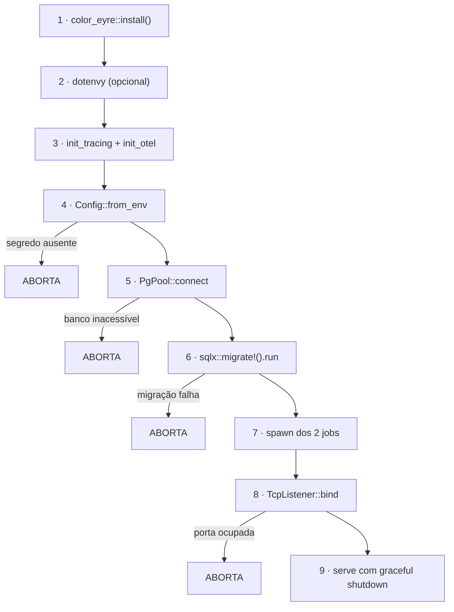

# Build e implantação

## Objetivo

Documentar como o artefato é construído, o que ele contém, como o serviço inicia e
para, e quais são os pontos de atenção de uma implantação.

## Escopo

Coberto: build, imagem, boot, ciclo de vida do processo, orquestração e rollback. Não
coberto: incidentes (ver [runbooks.md](runbooks.md)), telemetria (ver
[observability.md](observability.md)) e primeira instalação local (ver
[../getting-started/installation.md](../getting-started/installation.md)).

> **Estado atual: não há ambiente de produção.** O projeto é reproduzível localmente e
> preparado para container. Este documento descreve o que **existe** (build, imagem,
> boot, compose) e marca explicitamente o que **seria necessário** para operar de
> verdade.

---

## 1. O artefato

**Um binário único.** Templates, migrações e assets estáticos vão **dentro** dele:

| Conteúdo | Mecanismo |
| --- | --- |
| Templates HTML | `#[derive(Template)]` do Askama, em tempo de compilação |
| Migrações SQL | `sqlx::migrate!()`, lê `migrations/` na compilação |
| CSS, htmx, máscara monetária | `include_str!` de `static/` |
| Queries verificadas | Cache `.sqlx/` versionado, via `SQLX_OFFLINE` |

Consequência: o deploy não precisa copiar `templates/`, `migrations/` nem `static/`.
E não há passo manual de migração.

## 2. Build

### Local

```bash
cargo build --release
```

Produz `target/release/wallet`. O `.cargo/config.toml` define `SQLX_OFFLINE = "true"`,
então **o build não precisa de banco**.

### Imagem Docker

```bash
docker build -t wallet .
```

Multi-stage, com uma separação deliberada:

| Estágio | Base | O que faz |
| --- | --- | --- |
| `builder` | `rust:1.95-slim` | Instala `pkg-config`, `libssl-dev`, CAs extras opcionais; compila com `SQLX_OFFLINE=true` |
| `runtime` | `debian:bookworm-slim` | Instala `ca-certificates`, `libssl3`, `curl`; cria usuário `uid 10001`; copia **só o binário** |

Propriedades de segurança verificáveis no `Dockerfile`:

- **Só o binário** vai para o runtime — nenhuma toolchain, código-fonte ou dependência
  de build.
- **Usuário sem privilégio** (`useradd --system --uid 10001 wallet`): um
  comprometimento não ganha root.
- **O binário nasce sem nunca ter falado com um banco.**

Por que `debian:bookworm-slim` e não `distroless`: `reqwest` com `native-tls` precisa
de `libssl3`, e o healthcheck do compose usa `curl`. Migrar para `rustls` tornaria
`distroless` viável.

### Artefatos versionados que precisam estar em dia

Dois arquivos gerados são **versionados**, e podem descolar da fonte:

| Artefato | Gerado de | Verificação no CI | Se descolar |
| --- | --- | --- | --- |
| `.sqlx/` (31 queries) | Schema do banco | `cargo sqlx prepare --check` | Build compila contra schema errado |
| `static/app.css` | `styles/app.css` + templates | Recompila e faz `diff` | **Estilo faltando em produção** — nada no build de Rust perceberia |

Regenerar:

```bash
cargo sqlx prepare
```

```bash
./tools/tailwindcss -i styles/app.css -o static/app.css --minify
```

> A versão do Tailwind CLI precisa ser **exatamente 4.3.3** — é a que o CI usa, e
> divergir produz `diff` espúrio.

## 3. Sequência de boot



**Quatro pontos abortam o boot**, todos deliberadamente:

| Etapa | Falha | Por que abortar |
| --- | --- | --- |
| 4 | Segredo ausente ou vazio | Subir sem `JWT_SECRET` produziria 401 confusos em produção |
| 5 | Banco inacessível | Sem banco o serviço não faz nada útil |
| 6 | Migração falha | "Melhor não subir do que subir contra um schema pela metade" |
| 8 | Porta ocupada | — |

**Uma falha NÃO aborta:** montar o exportador OTLP. Observabilidade é infraestrutura
auxiliar, "não algo pelo qual vale a pena recusar servir requisições financeiras".

> **Consequência operacional:** um deploy com migração ruim **derruba o serviço** em
> vez de subi-lo degradado. Procedimento em [runbooks.md](runbooks.md) §4.

## 4. Ciclo de vida do processo

### Iniciar

```bash
docker compose --profile app up -d
```

```bash
docker run -d --name wallet -p 3000:3000 -e DATABASE_URL=... -e ADMIN_SECRET_KEY=... -e JWT_SECRET=... wallet
```

### Parar

```bash
docker compose --profile app down
```

**Desligamento gracioso:** o serviço trata `SIGTERM` (usado por Docker e Kubernetes) e
`Ctrl+C`. Ao receber o sinal:

1. Para de aceitar novas conexões.
2. **Deixa as requisições em voo terminarem.**
3. O `Drop` do `OtelGuard` escoa spans e métricas ainda em buffer.

> **Os dois jobs em segundo plano não participam do shutdown gracioso.** Uma rodada de
> cotações em andamento é abortada. Como a rodada é transacional no banco, não há
> estado parcial persistido — mas a rodada simplesmente não acontece.

### Reiniciar

```bash
docker compose --profile app restart app
```

O que se perde no reinício, **por desenho**:

| Estado | Consequência |
| --- | --- |
| Snapshot de mercado | A tela fica em carregamento por até `MARKET_SYNC_SECONDS` |
| Contadores de lockout | Todos os bloqueios são zerados |
| Cooldown de cotações | O botão manual volta a ficar disponível |

## 5. Verificação pós-deploy

```bash
curl -fsS http://localhost:3000/healthz
```

```bash
curl -fsS http://localhost:3000/readyz
```

Ambos com `200` significam serviço pronto. Verificação funcional mínima:

```bash
curl -fsS http://localhost:3000/api/v1/assets
```

Se o catálogo vier vazio numa instalação nova, a primeira rodada de cotações ainda
não completou — ou não tem acesso à rede.

### Lista de verificação

| # | Item | Como verificar |
| --- | --- | --- |
| 1 | Serviço vivo | `/healthz` → `200` |
| 2 | Banco acessível | `/readyz` → `200` |
| 3 | Migrações aplicadas | Boot sem erro (aborta se falhar) |
| 4 | **Cookies `Secure` ativos** | `curl -sI .../login` contém `strict-transport-security` |
| 5 | Cabeçalhos de segurança | `curl -sI` contém `content-security-policy` |
| 6 | Catálogo povoado | `GET /api/v1/assets` não vazio |
| 7 | Mercado atualizando | `/market` sai do estado de carregamento |
| 8 | Telemetria (se configurada) | Traces chegando ao coletor |

> **O item 4 é o mais importante e o mais fácil de errar.** `COOKIE_SECURE` é comparado
> **literalmente** com `"true"`: `TRUE`, `1` e `yes` resultam em `false`,
> silenciosamente. A presença do cabeçalho HSTS é a confirmação de que a flag pegou.

## 6. Perfis do Docker Compose

| Perfil | Serviços | Comando | Uso |
| --- | --- | --- | --- |
| *(padrão)* | `db` | `docker compose up -d` | Desenvolvimento com `cargo run` |
| `app` | `db` + `app` | `docker compose --profile app up --build` | Validar o artefato de produção |
| `observability` | `otel-collector` | `docker compose --profile observability up -d otel-collector` | Verificar a exportação |

A separação existe porque "o ciclo do dia a dia (editar código, `cargo run`) e o ciclo
de validar o artefato de produção têm necessidades diferentes — o primeiro não deveria
pagar o custo de rebuildar a imagem a cada mudança de uma linha."

> Os segredos padrão do compose (`dev-admin-secret-change-me`) são adequados para uso
> local e **nunca** para ambiente exposto.

## 7. Requisitos de orquestração

| Aspecto | Configuração recomendada | Motivo |
| --- | --- | --- |
| Liveness probe | `GET /healthz` | **Não toca o banco** — reiniciar não conserta um Postgres fora do ar |
| Readiness probe | `GET /readyz` | Exige o banco; tira do balanceador sem reiniciar |
| Sinal de parada | `SIGTERM` | Tratado, com drenagem |
| Período de graça | ≥ 30 s | Permitir drenagem das requisições em voo |
| Réplicas | **1** | Ver §8 |
| Porta | 3000 (`BIND_ADDR`) | — |
| Usuário | `uid 10001` | Já definido na imagem |
| Sistema de arquivos | Somente leitura possível | O serviço não escreve em disco |
| TLS | **Terminado por proxy reverso** | A aplicação fala HTTP puro |

## 8. Restrição de escala: instância única

**O sistema presume uma instância.** Rodar múltiplas réplicas produz três problemas:

| Estado | Consequência com N réplicas |
| --- | --- |
| `LoginThrottle` (memória) | Lockout **por instância** — N vezes mais tentativas toleradas |
| `QuoteSync` (`Mutex`) | A serialização das rodadas deixa de valer globalmente |
| `Market` (memória) | Cada réplica mantém o seu snapshot e faz as suas chamadas — **N× o consumo da API externa** |

Nenhum causa corrupção de dado — o banco protege as operações financeiras com
transação e `FOR UPDATE`. O impacto é em **eficácia de defesa** e **consumo de API
externa**.

Registrado em [../decisions/known-limitations.md](../decisions/known-limitations.md).

## 9. Rollback

Voltar a uma versão anterior da imagem:

```bash
docker compose --profile app down
```

```bash
docker run -d --name wallet -p 3000:3000 --env-file .env wallet:<tag-anterior>
```

> ⚠️ **O rollback do código não reverte as migrações.** As migrações são aplicadas no
> boot e **não** são desfeitas ao voltar a versão. Se a versão nova aplicou uma
> migração incompatível com a anterior, o rollback do binário **não é suficiente**.

Avaliar antes de reverter:

| Pergunta | Se sim |
| --- | --- |
| A versão nova aplicou migração? | O binário antigo pode não funcionar com o schema novo |
| A migração é destrutiva (`DROP COLUMN`)? | **Reverter o schema perde dado** |
| Há `.down.sql` correspondente? | Existe — mas **nunca foi testado** |

**Os arquivos `.down.sql` das 11 migrações existem e nenhum é executado por teste.** A
reversibilidade é afirmada por construção, não verificada. Ver
[../data/migrations.md](../data/migrations.md) §3, que documenta quais reversões
perdem dado.

## 10. Pipeline de CI

Quatro jobs **independentes e paralelos**:

| Job | Passos | Precisa de banco? |
| --- | --- | :---: |
| `lint` | `fmt --check`, `clippy -D warnings`, frescor do CSS | Não |
| `test` | `sqlx migrate run`, `sqlx prepare --check`, `cargo test` | **Sim** (`postgres:18`) |
| `audit` | `cargo audit` | Não |
| `docker` | `docker build .` | Não |

Gatilhos: push em `master` e todo pull request.

> **O CI não publica imagem nem faz deploy.** O job `docker` prova que a imagem
> **compila** — não que ela sobe e serve. Publicação e implantação seriam passos
> adicionais.

## 11. O que falta para operar de verdade

Registrado para que a ausência não seja confundida com omissão:

| # | Item | Estado |
| --- | --- | --- |
| 1 | Ambiente de produção | **Não existe** |
| 2 | Publicação de imagem em registry | Não configurada |
| 3 | Versionamento de imagem por tag | Não configurado |
| 4 | Terminação TLS | Exige proxy reverso |
| 5 | **Backup do banco** | **Não implementado** — ver [backup-and-recovery.md](backup-and-recovery.md) |
| 6 | Alertas | Não definidos |
| 7 | Teste de que a imagem sobe e serve | Não existe |
| 8 | Teste de reversão de migração | Não existe |
| 9 | Expurgo de `sessions` e `portfolio_snapshots` | Não existe |
| 10 | Rate limiting global | Fora da aplicação |

## 12. Evidências

```text
- Dockerfile                 (dois estágios, uid 10001, SQLX_OFFLINE)
- .dockerignore              (target/, .git/, .env, tools/, *.md)
- docker-compose.yaml        (perfis db, app, observability)
- .github/workflows/ci.yml   (4 jobs)
- src/app.rs                 · App::start, shutdown_signal, liveness, readiness
- src/config.rs              · Config::from_env (fail-fast)
- .cargo/config.toml         (SQLX_OFFLINE)
- migrations/                (aplicadas no boot)
```
