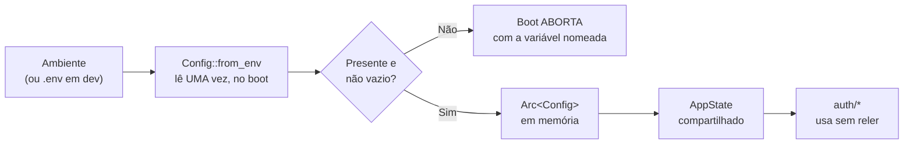

# Gestão de segredos

## Objetivo

Documentar quais segredos o sistema usa, onde vivem, como são protegidos, o que
acontece ao trocá-los e quais lacunas existem no tratamento.

## Escopo

Coberto: os quatro segredos do sistema, seu ciclo de vida, procedimentos de geração e
troca, e o que fazer em caso de vazamento. Não coberto: o efeito funcional de cada
variável (ver [../getting-started/configuration.md](../getting-started/configuration.md))
e a análise de risco (ver [threat-model.md](threat-model.md)).

---

## 1. Inventário

| Segredo | Onde vive | Sensibilidade | Rotação | Efeito de trocar |
| --- | --- | --- | --- | --- |
| `JWT_SECRET` | Ambiente → `Config` (memória) | **Crítica** | **Não implementada** | Invalida **todas** as sessões |
| `ADMIN_SECRET_KEY` | Ambiente → `Config` (memória) | **Crítica** | **Não implementada** | Integrações param até atualizarem |
| `DATABASE_URL` | Ambiente → `Config` (memória) | **Alta** (contém senha) | Fora da aplicação | Exige reinício |
| Hashes de senha | `users.password_hash` | Alta | Por usuário, no cadastro | — |

Além destes, dois valores derivados que **não** são configuráveis mas são sensíveis:

| Valor | Onde | Observação |
| --- | --- | --- |
| Refresh token (claro) | Cookie do navegador, memória | **Nunca** chega ao banco |
| Token CSRF | Cookie do navegador | 32 bytes de `OsRng` por sessão de navegador |

## 2. Ciclo de vida



Três propriedades desse desenho:

1. **Leitura única no boot.** Antes, validar um token ou conferir a credencial de
   admin lia a variável de ambiente a cada chamada.
2. ***Fail-fast*.** Segredo ausente derruba o serviço com mensagem clara. O motivo
   está registrado no código: antes, um `JWT_SECRET` ausente só aparecia na primeira
   requisição, **disfarçado de `401 invalid credentials`** — um erro de cliente para
   um problema de configuração nosso.
3. **Valor em branco é rejeitado como ausente** — "um segredo em branco é tão perigoso
   quanto um ausente".

> **O que a validação NÃO faz:** verificar comprimento, entropia ou se o valor é um
> dos exemplos públicos deste repositório. `JWT_SECRET=a` passa. Este é o principal
> risco Alto do [modelo de ameaças](threat-model.md) §3.1.

## 3. Proteções existentes

| Proteção | Implementação |
| --- | --- |
| Nunca serializados | Nenhum segredo aparece em resposta HTTP |
| Nunca logados diretamente | `Config` não implementa `Debug` que os exponha |
| 5xx censurado | Erro interno vira `"internal server error"` — a `DATABASE_URL` não vaza na resposta |
| Comparação em tempo constante | `ADMIN_SECRET_KEY` e token CSRF usam `subtle::ConstantTimeEq` |
| `.env` ignorado pelo git | Entrada explícita no `.gitignore` |
| `.env` fora da imagem | Entrada explícita no `.dockerignore` |
| Senha nunca em texto | Só a hash argon2 é persistida; o `Repository` nunca vê texto livre |
| Refresh token só como hash | SHA-256 no banco; o valor em claro nunca é gravado |
| Argumentos fora dos spans | `#[instrument(skip_all)]` nos handlers |

## 4. Lacunas

| # | Lacuna | Consequência | Prioridade |
| --- | --- | --- | --- |
| L1 | **Nenhuma validação de qualidade** | `JWT_SECRET=a` é aceito | **Alta** |
| L2 | **Valores de exemplo não são recusados** | `change-me` do `.env.example` pode ir para produção | **Alta** |
| L3 | **Sem rotação de `JWT_SECRET`** | Trocar derruba todas as sessões; não há suporte a duas chaves | Média |
| L4 | **Sem rotação de `ADMIN_SECRET_KEY`** | Trocar exige reinício e coordenação com integrações | Média |
| L5 | `DATABASE_URL` completa vai para o log em erro de conexão | Senha do banco no log | Média |
| L6 | Segredos padrão no `docker-compose.yaml` | `dev-admin-secret-change-me` funciona se ninguém sobrescrever | Média |
| L7 | Sem integração com gestor de segredos | Segredos como variáveis de ambiente simples | Baixa |
| L8 | Sem verificação automática de vazamento de segredo em log | Depende de disciplina (`skip_all`) | Média |

## 5. Gerar segredos adequados

**Comprimento recomendado: no mínimo 32 bytes de entropia real.**

```bash
openssl rand -base64 48
```

```bash
head -c 48 /dev/urandom | base64
```

```powershell
[Convert]::ToBase64String((1..48 | ForEach-Object { Get-Random -Maximum 256 }))
```

> Não use senha memorizável, nome de projeto, data nem valor derivado de outro
> segredo. Como `JWT_SECRET` é a chave HMAC que assina as sessões, sua entropia é o
> que separa um atacante de forjar uma sessão de admin.

## 6. Procedimento de troca

### `JWT_SECRET`

**Efeito: todas as sessões ativas são invalidadas.** Os access tokens deixam de
validar, e os refresh tokens — que são opacos e vivem no banco — continuam válidos,
mas a renovação emite um JWT novo com a chave nova. Na prática, usuários com access
token vigente são deslogados; os que têm refresh válido são renovados
transparentemente.

1. Gerar o novo valor.
2. Atualizar a variável no ambiente.
3. Reiniciar o serviço.
4. Confirmar que o boot subiu e `/readyz` responde `200`.

Fazer em janela de baixo uso, quando possível.

### `ADMIN_SECRET_KEY`

**Efeito: integrações máquina-a-máquina param até serem atualizadas.**

1. Gerar o novo valor.
2. **Atualizar os consumidores primeiro**, se houver janela de coordenação — não há
   suporte a duas credenciais simultâneas, então a troca é atômica e interruptiva.
3. Atualizar a variável e reiniciar.
4. Validar:

```bash
curl -s -o /dev/null -w '%{http_code}\n' -X PATCH http://127.0.0.1:3000/api/v1/assets -H "Authorization: $ADMIN_SECRET_KEY" -H 'Content-Type: application/json' -d '{"id":1}'
```

`200` confirma que a nova credencial vale.

> Sessões de usuários com papel `admin` **continuam funcionando** — o caminho 1 da
> autorização não depende desta credencial.

### `DATABASE_URL`

1. Trocar a senha no servidor de banco.
2. Atualizar a variável.
3. Reiniciar. O boot falha imediatamente se a credencial estiver errada — o que é o
   comportamento desejado.

## 7. Em caso de vazamento

### `JWT_SECRET` vazado — **crítico**

Quem tem o segredo **pode forjar qualquer sessão, inclusive de admin**.

1. **Trocar imediatamente** e reiniciar. Isso invalida os tokens forjados.
2. Revogar todas as sessões:

   ```sql
   UPDATE sessions SET revoked_at = NOW() WHERE revoked_at IS NULL;
   ```

3. Auditar `assets.unit_value` em busca de alteração indevida — é o que uma sessão de
   admin forjada permitiria alterar. **Não há trilha de auditoria**, então a
   verificação é por inspeção do valor atual contra a cotação de mercado.
4. Auditar `transactions` por movimentações inesperadas.

### `ADMIN_SECRET_KEY` vazada — **crítico**

1. Trocar imediatamente e reiniciar.
2. **Auditar `assets.unit_value`** — é exatamente o que essa credencial controla.
3. Conferir se algum ativo tem preço implausível.

### `DATABASE_URL` vazada

1. Trocar a senha do banco e a variável.
2. Considerar o conteúdo do banco como comprometido: hashes argon2 (custosas), hashes
   de refresh token (**inúteis** — o valor em claro nunca foi gravado), e **extrato e
   saldos em texto**, porque não há criptografia em repouso.
3. Avaliar a necessidade de notificar os usuários.

## 8. Boas práticas por ambiente

### Desenvolvimento

- `.env` a partir de `.env.example`, com valores **próprios** — os do exemplo são
  públicos.
- Nunca versionar `.env` (já está no `.gitignore`).
- Segredos de dev **nunca** são reaproveitados em produção.

### CI

O workflow usa valores fixos e não sensíveis (`ci-admin-secret`, `ci-jwt-secret`),
porque o boot valida **presença**, não valor. Isso é adequado: não há dado real no CI.

Segredo real que venha a ser necessário deve usar GitHub Secrets, nunca literal no
YAML.

### Produção

| Prática | Estado |
| --- | --- |
| Segredos por variável de ambiente do orquestrador | Suportado |
| `COOKIE_SECURE=true` (exatamente) | **Obrigatório** — ver DT-04 |
| Segredos distintos por ambiente | Responsabilidade de quem opera |
| Gestor de segredos (Vault, AWS SM) | **Não integrado** — a aplicação só lê variáveis |
| Rotação periódica | **Não suportada** sem interrupção |

## 9. Ações recomendadas

| # | Ação | Lacuna | Esforço |
| --- | --- | --- | --- |
| 1 | Exigir comprimento mínimo (32+ caracteres) no boot | L1 | **Baixo** |
| 2 | Recusar valores de exemplo conhecidos (`change-me`) | L2 | **Baixo** |
| 3 | Sanitizar a senha da `DATABASE_URL` antes de logar | L5 | Baixo |
| 4 | Remover os valores padrão do `docker-compose.yaml` | L6 | Baixo |
| 5 | Suportar duas chaves JWT simultâneas (rotação sem interrupção) | L3 | Médio |
| 6 | Tabela de API keys com escopo e revogação individual | L4 | Médio |

As duas primeiras são de baixo esforço e fecham os únicos riscos classificados como
Alto no [modelo de ameaças](threat-model.md).

## 10. Evidências

```text
- src/config.rs          · Config, from_env, required (valida presença, não qualidade)
- src/auth/user.rs       · auth_token, from_auth_token
- src/auth/admin.rs      · ct_eq
- src/auth/session.rs    · hash_token (SHA-256 do refresh)
- src/error.rs           · IntoResponse (censura de 5xx)
- .gitignore             (.env)
- .dockerignore          (.env)
- .env.example           (valores claramente marcados como change-me)
- docker-compose.yaml    (padrões de desenvolvimento)
- .github/workflows/ci.yml (segredos de teste)
```
