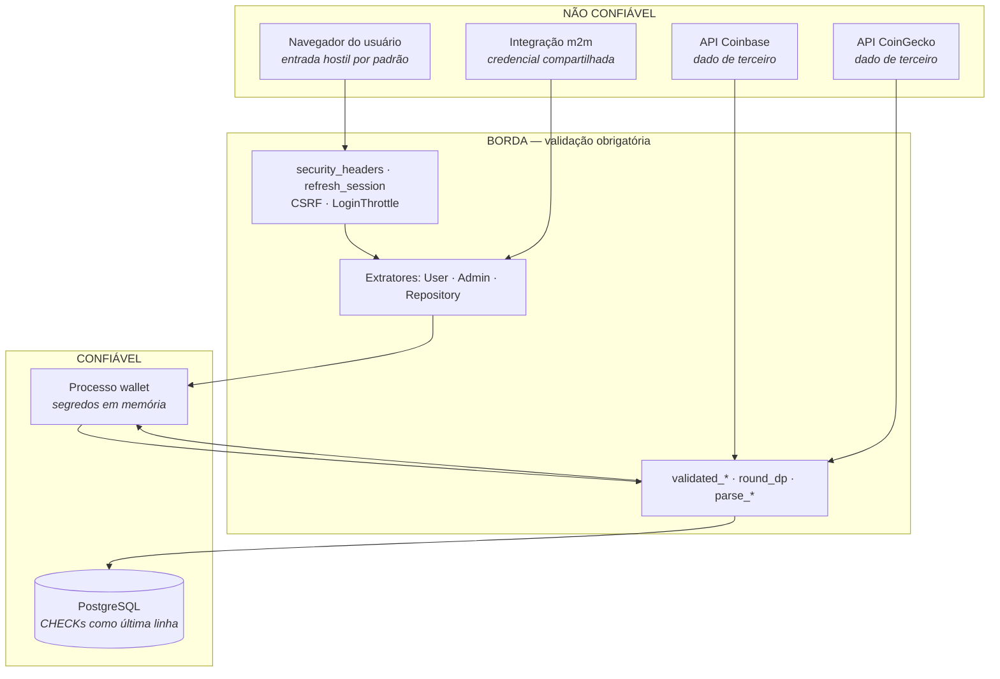

# Arquitetura de segurança

## Objetivo

Descrever os controles de segurança implementados, onde cada um atua e qual é o seu
limite. Serve de mapa: para cada camada de defesa, o que ela cobre e o que ela **não**
cobre.

## Escopo

Coberto: fronteiras de confiança, superfícies de ataque, controles por camada e
riscos residuais estruturais. Não coberto: o inventário ativo × ameaça (ver
[threat-model.md](threat-model.md)), gestão de segredos (ver
[secrets-management.md](secrets-management.md)) e o contrato observável de
autenticação (ver [../api/authentication.md](../api/authentication.md)).

> **Este documento não declara o sistema seguro.** Ele descreve controles, seus
> limites e os riscos que permanecem. Um sistema com criptografia e autenticação não
> é, por isso, seguro — é apenas um sistema com dois controles.

---

## 1. Fronteiras de confiança



Quatro origens externas, **nenhuma confiável**. Três observações que a fronteira
torna explícitas:

1. **A CoinGecko não cruza para o banco.** O snapshot vive só em memória, o que
   impede que dado de terceiro contamine o catálogo que lastreia operações.
2. **A Coinbase cruza**, e é por isso que o parse dela é a integração mais testada do
   projeto (5 testes de contrato contra payload real).
3. **O banco está dentro da fronteira confiável**, mas ainda assim tem `CHECK` — é
   defesa em profundidade contra um bug na camada Rust, não desconfiança do banco.

## 2. Superfícies de ataque

| # | Superfície | Exposição | Controles |
| --- | --- | --- | --- |
| S1 | Formulários HTML (6 rotas `POST`) | Pública | CSRF, lockout, validação, `SameSite=Strict` |
| S2 | Escritas da API (`POST`/`PATCH /api/*/assets`) | Pública | `Admin` (dois caminhos), comparação em tempo constante |
| S3 | Leituras autenticadas (`/assets`, `/market`, CSV) | Pública | Extrator `User`, `no-store` |
| S4 | Leituras públicas (`GET /api/*/assets`, OpenAPI) | Pública | Nenhum — por decisão: preço não é dado privado |
| S5 | Sondas (`/healthz`, `/readyz`, `/health`) | Pública | Nenhum — respondem só status |
| S6 | Assets estáticos | Pública | `ETag`, conteúdo fixo no binário |
| S7 | Query strings (`?page`, `?coin`, `?range`, `?q`, `?next`) | Pública | Tipagem, `clamp`, validação de `next` |
| S8 | Cookies (5) | Navegador | `HttpOnly`, `SameSite=Strict`, `Secure` condicional |
| S9 | Respostas de terceiros | Rede | Parse tipado, timeout de 15 s, escala travada |
| S10 | Variáveis de ambiente | Host | Validação *fail-fast* |
| S11 | Conexão com o banco | Rede interna | Credencial em `DATABASE_URL` |

**S4 é uma exposição deliberada:** o catálogo de ativos e seus preços são públicos. A
consequência é que um observador externo conhece o catálogo — o que é aceitável,
porque não há informação de usuário ali.

## 3. Controles por camada

### 3.1 Transporte

| Controle | Estado | Limite |
| --- | --- | --- |
| HTTPS | **Fora da aplicação** — responsabilidade do proxy reverso | O serviço fala HTTP puro |
| HSTS | `max-age=63072000; includeSubDomains` | **Só se `COOKIE_SECURE=true`** |
| Cookies `Secure` | Condicional | Mesma condição — e a comparação é literal (DT-04) |
| TLS para terceiros | `native-tls`, validação padrão | Sem *certificate pinning* |
| TLS para o banco | Depende de `DATABASE_URL` | Não forçado pela aplicação |

> **A aplicação não termina TLS.** Ela deve rodar atrás de um proxy que o faça, e
> `COOKIE_SECURE=true` é o que alinha o comportamento dos cookies a isso.

### 3.2 Cabeçalhos HTTP

Aplicados a **toda** resposta, inclusive erros e 404, porque `security_headers` roda
antes do roteamento:

| Cabeçalho | Valor | Protege contra |
| --- | --- | --- |
| `Content-Security-Policy` | `default-src 'self'; script-src 'self'; style-src 'self'; img-src 'self' data:; connect-src 'self'; frame-ancestors 'none'; form-action 'self'; base-uri 'self'; object-src 'none'` | XSS, injeção de recurso, exfiltração |
| `X-Content-Type-Options` | `nosniff` | Confusão de tipo MIME |
| `X-Frame-Options` | `DENY` | Clickjacking |
| `Referrer-Policy` | `no-referrer` | Vazamento de URL interna |
| `Cache-Control` | `no-store` (exceto `/static/`) | Dado privado em cache de proxy ou histórico |
| `Strict-Transport-Security` | Condicional | Downgrade para HTTP |

**A CSP não tem `'unsafe-inline'`**, e essa é a propriedade mais difícil de manter: ela
só é possível porque nenhuma página emite `<style>` ou `<script>` inline. O
invariante é travado por teste (`pages_carry_no_inline_style_or_script`), e é o que
sustenta toda a diretiva.

Consequência de projeto: **todo indicador proporcional é geometria de SVG**, não CSS
inline. Não existe `style="width:63%"` no sistema.

### 3.3 Autenticação

| Controle | Implementação | Limite |
| --- | --- | --- |
| Hash de senha | argon2 via `password-auth` | Sem política de complexidade além do comprimento |
| Limites de cadastro | Username 3–32, senha 8–128 | O teto evita DoS no cálculo da hash |
| Token de acesso | JWT HS256, 10 min | **Não revogável** até expirar |
| Refresh token | 32 bytes opacos, hash SHA-256 no banco | — |
| Rotação | A cada uso, atômica | Duas abas simultâneas: uma perde |
| Revogação | `revoked_at` no logout | Só o refresh; o access vive até expirar |
| Lockout | 5 tentativas, backoff até 15 min | **Em memória** — reinício zera; por instância |

**Ausências relevantes:** MFA, recuperação de senha, troca de senha, verificação de
e-mail, bloqueio de conta, listagem de sessões ativas, rotação de chave.

### 3.4 Autorização

| Controle | Implementação |
| --- | --- |
| Papéis | `user` / `admin`, com `CHECK` no schema e `DEFAULT 'user'` |
| Extrator `Admin` | Sessão com papel **ou** credencial de serviço |
| Precedência | Sessão sem papel admin ⇒ **nega imediatamente**, sem cair no header |
| Comparação de segredo | Tempo constante (`subtle::ConstantTimeEq`) |
| Isolamento por usuário | **Toda** leitura filtra por `user_id` da sessão |

O isolamento por `user_id` é o que torna aceitável o uso de `BIGSERIAL` em vez de
UUID: os ids só aparecem em superfícies autenticadas, e enumerá-los não expõe dado de
terceiros.

### 3.5 Validação de entrada

| Entrada | Controle |
| --- | --- |
| JSON e formulários | Desserialização tipada — tipo trocado é `400`/`422` antes do handler |
| Valores monetários | `> 0` ou `>= 0`, escala ≤ 8, arredondamento |
| Nome de ativo | Não vazio após `trim` |
| `?next=` | **Só caminho local absoluto** — barra open redirect |
| `?q=` | Normalizado e truncado em 32 caracteres |
| `?coin=`, `?range=` | Valor desconhecido cai no padrão |
| `x-request-id` externo | ≤ 64 caracteres, só alfanuméricos ASCII e `-` |
| SQL | **Sempre parametrizado** — `sqlx::query!` não concatena |
| HTML | Askama escapa por padrão |

**Não há injeção de SQL alcançável:** todas as consultas são parametrizadas, e as duas
consultas dinâmicas do sistema (bootstrap do catálogo, `SELECT 1`) não interpolam
entrada de usuário.

### 3.6 Integridade de dados

Toda restrição financeira existe em **duas camadas** — validada em Rust e garantida
no schema:

| Invariante | Rust | Schema |
| --- | --- | --- |
| Saldo ≥ 0 | Verificação em transação | `CHECK` |
| Posição ≥ 0 | Verificação em transação | `CHECK` |
| Preço ≥ 0 | `validated_unit_value` | `CHECK` |
| Quantidade > 0 | Validação de entrada | `CHECK` |
| Papel válido | `ROLE_ADMIN` | `CHECK` |
| Tipo de transação | Enum interno | `CHECK` |
| **Escala ≤ 8** | `round_dp` | **Ausente** |

> A escala é o único invariante **sem** garantia no schema. `NUMERIC` sem precisão
> declarada aceita qualquer valor, e foi por essa fresta que passou o incidente de
> 2026-07-22.

Atomicidade: toda operação monetária roda em transação com `FOR UPDATE`, e qualquer
recusa reverte por completo.

### 3.7 Tratamento de erro

| Classe | Cliente recebe | Log |
| --- | --- | --- |
| 4xx | Mensagem real | Não registra erro |
| 5xx | `"internal server error"` | **Erro completo com causa raiz** |

Nunca vazam na resposta: texto de erro do SQL, nome de coluna, string de conexão,
caminho de arquivo, stack trace.

Credencial inválida e usuário inexistente produzem a **mesma** mensagem — mensagens
distintas revelariam quais contas existem.

### 3.8 Cadeia de suprimentos

| Controle | Estado |
| --- | --- |
| `cargo audit` | No CI, a cada push e PR |
| `Cargo.lock` | Versionado |
| Dependências JS no build | **Zero** — sem Node, sem npm |
| CDN de terceiro | **Zero** — htmx e CSS saem do binário |
| Imagem base | `debian:bookworm-slim`, usuário `uid 10001` |
| Advisory aberto | RUSTSEC-2023-0071, ignorado com justificativa |

**A ausência de cadeia npm é um controle**, não um detalhe: o build não herda a
superfície de ataque do ecossistema JavaScript.

Limites: o `cargo audit` só roda em push/PR (advisory publicado em período sem
commits passa despercebido), e **não alcança o htmx vendorado**, que é JavaScript.

## 4. Riscos residuais estruturais

Consequências das decisões, não defeitos pontuais:

| # | Risco residual | Por quê | Mitigável? |
| --- | --- | --- | --- |
| RR-1 | Access token não revogável por até 10 min | JWT é stateless por desenho | Reduzir o TTL |
| RR-2 | Revogação de privilégio não é imediata | `role` viaja nas claims | Consultar o banco por requisição, ao custo de latência |
| RR-3 | Lockout por instância, perdido no restart | Estado em memória | Armazenamento compartilhado |
| RR-4 | `JWT_SECRET` sem rotação | Sem suporte a duas chaves | Implementar |
| RR-5 | `ADMIN_SECRET_KEY` compartilhada, sem escopo nem auditoria | Segredo único | Tabela de API keys |
| RR-6 | Escala não garantida pelo schema | `NUMERIC` sem precisão | `NUMERIC(38, 8)` |
| RR-7 | `sessions` e `portfolio_snapshots` crescem sem limite | Sem expurgo | Job de limpeza |
| RR-8 | Sem trilha de auditoria de alteração de preço | Não implementada | Tabela de log |
| RR-9 | htmx vendorado fora do `cargo audit` | É JavaScript | Verificação própria |
| RR-10 | Sem `Retry-After` em 429/503 | Não implementado | Acrescentar |
| RR-11 | Operações financeiras não idempotentes | Sem chave de idempotência | Implementar |
| RR-12 | Sem limite global de requisições | Só o login é limitado | Proxy reverso |

## 5. O que **não** existe

| Controle | Estado | Comentário |
| --- | --- | --- |
| WAF | Não | Fora da aplicação |
| Rate limiting global | **Não** | Só lockout de login |
| Detecção de intrusão | Não | — |
| Criptografia em repouso | **Não** | Nada é cifrado no banco além da hash de senha |
| Assinatura de payload | Não | — |
| Proteção contra repetição | **Parcial** | A rotação de refresh impede replay do token; **não há nonce nas operações** |
| Segregação de rede | Fora do escopo | Depende do orquestrador |
| Backup | **Não implementado** | Ver [../operations/backup-and-recovery.md](../operations/backup-and-recovery.md) |
| Verificação de dado sensível em log | **Não** | Disciplina de código (`skip_all`) |

> **Não há criptografia em repouso.** Saldo, posições e extrato ficam em texto no
> Postgres. Para um sistema educacional que não movimenta dinheiro real é adequado;
> para operação real, seria exigência a avaliar.

## 6. Evidências

```text
- src/app.rs             · security_headers, request_tracing
- src/auth/user.rs       · User, UnauthenticatedUser, valid_registration
- src/auth/session.rs    · refresh_session, RefreshToken, hash_token
- src/auth/admin.rs      · Admin::from_request_parts
- src/auth/csrf.rs       · ensure_csrf_token, verify_csrf
- src/auth/throttle.rs   · LoginThrottle
- src/error.rs           · IntoResponse (censura de 5xx)
- src/repository.rs      · validated_*, buy_asset (FOR UPDATE), rotate_session
- src/routes/frontend.rs · set_language (validação de next)
- migrations/20260716000000_financial_guardrails.up.sql
- .cargo/audit.toml
- Dockerfile             (usuário sem privilégio)
```
